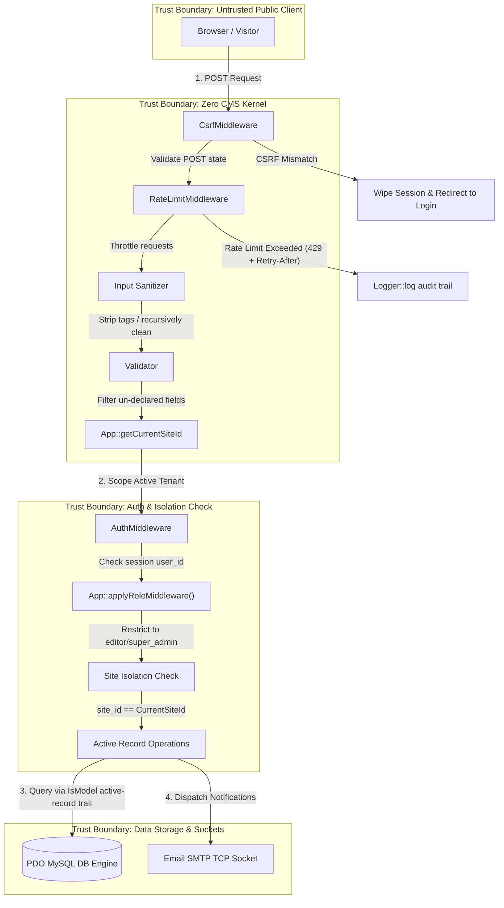

# Zero CMS — Purist Enterprise Architecture & Security Ledger

```text
  ███████╗███████╗██████╗  ██████╗      ██████╗███╗   ███╗███████╗
  ╚══███╔╝██╔════╝██╔══██╗██╔═══██╗    ██╔════╝████╗ ████║██╔════╝
    ███╔╝ █████╗  ██████╔╝██║   ██║    ██║     ██╔████╔██║███████╗
   ███╔╝  ██╔══╝  ██╔══██╗██║   ██║    ██║     ██║╚██╔╝██║╚════██║
  ███████╗███████╗██║  ██║╚██████╔╝    ╚██████╗██║ ╚═╝ ██║███████║
  ╚══════╝╚══════╝╚═╝  ╚═╝ ╚═════╝      ╚═════╝╚═╝     ╚═╝╚══════╝
  "Zero Dependencies. Zero Bloat. Absolute Structural Integrity."
```

## Introduction & Purist Manifesto

**Zero CMS** is a zero-dependency, ultra-high-performance, multi-tenant content management system and transactional e-commerce platform. In an era dominated by bloated, nested package-manager architectures and vulnerable dependency spiders, Zero CMS takes a radical return to fundamental software engineering principles:

* **Zero Third-Party Runtime Dependencies:** No NodeJS, no npm, no Tailwind, no third-party framework wrappers, no `vendor/autoload.php` in the request path — everything runs on bare-metal native PHP and raw SQL. Composer is used solely as a versioned install/update mechanism for embedding Core into a host project (see `bin/create-project`), never as a runtime dependency manager.
* **Instantaneous execution (Sub-1ms):** Bypasses all middleware boot latency and array-scanning dispatchers.
* **Hardened Security Boundaries:** Engineered to resist AI-automated vulnerability scans via zero-dependency CSRF, input recursive sanitization, honed honeypots, rate limiters, and strict multi-tenant Active-Record scoping.

---

## 1. System Bootstrapping & Cascading MVC Architecture

Zero CMS routes and resolves multi-tenant contexts in a single, highly optimized workflow:

```text
[HTTP Web Request]
       │
       ▼
[index.php (Front Controller Gateway)]
       │
       ▼
[App::bootstrap() - UNION ALL Context Extraction]
       │
       ├──► Query DB (UNION ALL): Site Configuration + Authenticated User
       ▼
[Router::handle() - Route Pattern Matcher]
       │
       ├──► Is module enabled for active Site?
       │     ├── YES: Load module controllers & Views
       │     └── NO : Skip route mapping (Return 404)
       ▼
[View Cascading Resolver]
       ├──► Check `/src/Views/themes/{activeSiteTheme}/{template}.php`
       └──► Fallback to `/src/Views/themes/default/{template}.php` (Cascading inheritance)
```

### Single-Query UNION ALL Bootstrapping
On bootstrap, Zero CMS resolves the active tenant Site details (via `Security::resolveTrustedHost()`, which prefers a verified `X-Forwarded-Host` over `HTTP_HOST` when a reverse proxy sits in front of the origin — see Section 5) and the logged-in User profile (via session `user_id`) in a **single-query database roundtrip** using a consolidated `UNION ALL` query, avoiding redundant TCP connection overhead. `App.php` is a thin shell composed of focused traits under `src/Core/Concerns/`; the query itself lives in `ResolvesTenantContext::bootstrapFetchSiteAndUser()` (inside `src/Core/Concerns/ResolvesTenantContext.php`):

```sql
SELECT
    'site' AS record_type, id, name, domain, theme, enabled_modules,
    homepage_id, timezone, default_language, settings,
    NULL AS email, NULL AS password_hash, NULL AS role, NULL AS site_id, NULL AS preferences,
    created_at, updated_at
FROM sites WHERE domain = ?
UNION ALL
SELECT
    'user' AS record_type, id, username AS name, NULL AS domain, NULL AS theme, NULL AS enabled_modules,
    NULL AS homepage_id, NULL AS timezone, NULL AS default_language, NULL AS settings,
    email, password_hash, role, site_id, preferences,
    created_at, updated_at
FROM users WHERE id = ?
```

---

## 2. Platform Modules

Zero CMS is divided into fully decoupled, modular plug-ins under `src/Modules/`:

1. **Pages & Dynamic Layout Block Builder (`Admin`):**
   Pages are stored in the database as serialized JSON arrays of content blocks (e.g. Accordions, Galleries, Testimonials, Sub-Pages). Adding a block admin view automatically registers editing schemas generically in the back-office, while custom blocks render on the frontend cascadingly.
2. **Form Builder & archival Submissions (`FormBuilder`):**
   Enables designers to construct customized forms inside the page builder dynamically. Submissions are validated through `Validator` and archived securely as dynamic JSON structures, preserving exact submission history even if the source page or form is later deleted.
3. **Platform Security Hardening & AI Auditing (`Security`):**
   Integrates globally enforced Content Security Policy (CSP), defensive HTTP shielding, secure forced password updates, security audit logging, automated OSV-based CVE comparative auditing against Laravel/Symfony/WordPress (`CveFetcherService`), and AI-driven threat-modeling narrative generation with Google's generative AI (`AiService`).
4. **Background Jobs & Task Scheduler (`Queue`):**
   Dispatches and processes queued jobs (e.g. `PurgeOldLogsJob`) via `QueueManager` and a cron-driven `Scheduler`, run out-of-band through the `bin/queue-runner` and `bin/scheduler` CLI entry points rather than inline on the request path.
5. **Site Search (`Search`):**
   Decoupled search-driver architecture (`SearchDriverInterface`) with a `DatabaseSearchDriver` implementation, exposed via `SearchController`/`SearchService` and a `Searchable` model trait.

---

## 3. Directory Layout Map

```text
/data/misc/zero/
├── GEMINI.md                    # System guidelines, coding standards, and developer rules
├── public/                       # Webroot (document root points here)
│   ├── index.php                 # Central Front-Controller Gateway
│   ├── assets/                   # Publicly accessible static assets
│   │   └── css/                  # Authored stylesheets (admin.css, blocks/, themes/)
│   │       └── cache/            # Compiled theme bundles (generated, disposable, gitignored)
│   └── storage/                  # Public-facing symlink/passthrough for uploaded media
│       ├── uploads/              # Tenant-scoped originals, exactly as uploaded
│       └── variants/             # Derived image renditions (disposable cache, never mixed with uploads)
├── bin/                          # CLI entry points (bin/seed, bin/test, bin/migrate, bin/assets, bin/queue-runner, bin/scheduler, etc.)
├── storage/                      # Private file storage (uploads, logs)
├── src/                          # OOP core framework engine
│   ├── Core/                     # Kernel, Bootstrapping (App.php + Concerns/ traits), Env, Validator, Storage/ drivers (local, AWS S3, Google Cloud Storage)
│   ├── Database/                 # Connection (DB.php), Migration/MigrationManager, numbered Migrations/
│   ├── Http/                     # HTTP infrastructure, Router, Middleware, Controllers
│   ├── Integration/               # Cross-module integration test suite (Tests/ only)
│   ├── Interfaces/               # Strict OOP contracts
│   ├── Lang/                     # i18n translation tables (en.php, es.php, hr.php, mi.php)
│   ├── Models/                   # Core active-record entities (Media, Page, Site, User)
│   ├── Modules/                  # Decoupled extensible modules
│   │   ├── Admin/                # Unified Back-Office dashboard controller & views
│   │   ├── FormBuilder/          # Dynamic forms creation and submission logs module
│   │   ├── Queue/                # Background job queue & cron-style scheduler
│   │   ├── Search/               # Decoupled site search driver architecture
│   │   └── Security/             # Platform security hardening & AI threat auditing module
│   ├── Services/                 # Cross-cutting services (e.g. AiService + Ai/Providers)
│   ├── Support/                  # Security, Logger, Emailer, Seeder/SeederRunner, TestRunner, Str, I18n, Assets/ImageProcessor/VariantCache, StyleBundle, AssetVersion
│   └── Views/                    # Cascading theme templates (themes/{site theme}/, themes/default/)
```
Per-component tests live alongside the code they cover (e.g. `src/Core/Tests/`, `src/Modules/Search/Tests/`) rather than in a single top-level `tests/` directory — see Section 6.

---

## 4. Derived Assets: Image Variants & Theme Stylesheets

Every asset the platform serves carries its identity in its URL, so all of them can be cached
indefinitely and still be replaceable on deploy. Resized image renditions and compiled theme
stylesheets are *generated* on first request and cached at the path their URL describes; scripts and
standalone stylesheets are authored files whose URL merely carries a digest of their contents. In
all three cases the web server serves the file directly once it exists, and PHP is involved only to
produce something that does not.

### Image variants

Templates never reference an original image directly. They ask `Zero\Support\Assets` for the
rendition they actually need, and the engine produces it the first time a browser requests it:

```php
"
     srcset="<?php echo Str::escape(Assets::srcset($mediaUrl, [400, 600, 900], 4 / 3)); ?>"
     sizes="(max-width: 600px) 100vw, 300px"
     loading="lazy" decoding="async" alt="" />
```

Supplying both dimensions crops to fill, positioned on the image's stored focal point
(`media.focus_x` / `focus_y`), so the subject stays in frame instead of being centre-cropped out
of it. Supplying one scales proportionally without cropping. Renditions are never upscaled past
their source. Arguments are designed to be passed by name.

**Nothing that cannot be resized safely is rewritten.** Animated GIFs, SVGs, videos, non-image
files, access-gated private media and paths with no media record behind them are all returned
untouched, so `Assets::url()` is safe to wrap around every image URL unconditionally.

### How it stays fast

| Stage | Cost |
| :--- | :--- |
| `Assets::url()` during render | Pure computation — no filesystem stat, no query, no network |
| Extra queries per page | **Zero.** The existing batched block-media eager-load primes the registry |
| Warm HTTP request | Static file served by the web server; PHP is never invoked |
| Cold HTTP request | One primary-key lookup plus one GD render — once per rendition, ever |

The URL *is* the cache path (`/storage/variants/{site}/{shard}/{media}/{w}x{h}-{fit}-q{q}-{sig}.webp`).
A rewrite rule in `public/.htaccess` lets the web server satisfy the request off disk whenever that
file exists and falls through to the front controller only on a miss, where
`MediaVariantController` renders it, publishes it by atomic rename, and streams it back with
far-future immutable caching headers.

### Signed URLs and invalidation

Every URL embeds a truncated HMAC (keyed by `APP_KEY`) over the tenant, media id, dimensions, fit
mode, quality, and the source's version stamp. Two properties follow:

* **Only renditions the CMS itself minted can be generated.** The endpoint cannot be walked with
  arbitrary dimensions to burn CPU or fill the disk; an unsigned request is a flat 404 before any
  image work happens. A cross-tenant replay is refused for the same reason.
* **Editing an image rotates its URLs.** Because the signature covers `media.updated_at`, moving a
  focal point or replacing a file republishes every rendition under new URLs, which is what makes
  the `immutable` caching header truthful rather than optimistic.

Superseded files therefore stop being referenced rather than becoming stale. `bin/assets` reclaims
them:

```bash
bin/assets stats                              # cache file count and disk usage
bin/assets prune --older-than=90d             # drop renditions nothing has requested lately
bin/assets warm --site=<uuid> --widths=400,800  # pre-render a ladder after a bulk import
bin/assets clear [--site=<uuid>]              # discard the cache entirely
```

The cache is a deliberate sibling of the uploads tree, not a folder inside it: the media library
only ever lists uploads, deleting a media record only ever touches its own object, and the whole
cache can be discarded without endangering an original. Under the cloud storage drivers a variant
is written both to local disk (a hot per-instance cache the web server can serve statically) and
to the configured bucket (the durable copy a freshly started instance rehydrates from instead of
re-rendering); putting a CDN in front is recommended there.

---

### Scripts and standalone stylesheets

Anything referenced directly rather than compiled — the block scripts, the admin JS, `auth.css` —
goes through `Zero\Support\AssetVersion`, which inserts a digest of the file's contents into its
URL:

```php
<script src="<?php echo Str::escape(AssetVersion::url('/assets/js/blocks/gallery.js')); ?>"></script>
<!-- renders: /assets/js/blocks/gallery.81166959.js -->
```

Nothing is generated, merged or minified. The bytes served are the authored file; a rewrite rule
strips the digest back off before the web server resolves the path, so no PHP runs and no directory
needs to be writable. It exists purely so the URL changes when the file does.

Without it, `public/.htaccess` serves every `.js` and `.css` as `immutable, max-age=31536000` under
a filename that never changes — and `immutable` instructs a browser never to revalidate. A deployed
fix therefore could not reach anyone who had already visited, for up to a year. Two hand-rolled
workarounds had grown around the same problem and are now retired: a manual `?v=1.3` somebody had
to remember to bump, and a `?v=<?= time() ?>` that changed every request and so discarded caching
altogether.

Digests are over content, not mtime: a git checkout or docker build restamps every file, so an
mtime digest would invalidate every asset on every deploy even when nothing changed. A rollback
reuses the previously cached copy for the same reason.

> A URL bearing an out-of-date digest still resolves, serving the file's current contents rather
> than 404ing. That is deliberate — a page served from externally cached HTML keeps working — and
> harmless, since the next render points at the current digest.

### Theme stylesheets

A theme's stylesheet is compiled from many sources — `fonts.css`, the core block stylesheets, the
enabled modules' block stylesheets, then the active theme last — concatenated and minified into one
bundle. `Zero\Support\StyleBundle` owns that list, the order, and the naming; `CssBundleController`
is just the miss handler.

**Concatenation order is the cascade.** Block rules and the theme rules that restyle them share the
same selector specificity, so whichever file comes last wins. The theme therefore loads last and can
override any block by simply restating the selector — no `!important`, no deeper nesting. Reversing
that order does not break loudly; it silently makes every theme's block customization inert.

**The bundle is published to `assets/css/cache/`** — a dedicated directory, never the stylesheet
source tree it is compiled from. That keeps generated output discardable with one recursive delete,
keeps the ignore rule a directory rather than a filename pattern, and means a deployment makes only
that directory writable instead of recursively chmod-ing every authored stylesheet in the image.

**Its filename is content-addressed and tenant-scoped:**
`main-{theme}.{tenantScope}.{fingerprint}.css`. The fingerprint hashes every source file's path,
mtime and size; the scope is a short digest of the site id — a digest rather than the id itself, so
asset URLs do not publish tenant identifiers. Together they do a lot of work:

* A stylesheet edit changes the fingerprint, which changes the URL, which is a cache miss, which
  recompiles. There is no staleness to manage and no development-mode flag to remember.
* Because a given URL's bytes can never change, the far-future `immutable` header is truthful, and
  the hand-maintained `?v=` query string it replaced is gone.
* An ephemeral host — a fresh Cloud Run instance — simply compiles once. That costs well under a
  millisecond for the whole set, and the inputs ship inside the container image, so nothing is
  fetched or persisted remotely. Concurrent cold requests may each compile; the work is
  deterministic and published by atomic rename, so duplicating it is harmless.

* Two tenants never share a bundle. They can already compile different bytes from one theme,
  because the source set follows each site's enabled modules — so a shared name would have them
  serving each other's stylesheet from cache, and would leak one site's styling into another the
  moment anything else about a bundle becomes site-specific.

Pruning on publish keeps an edit or a deployment from leaving orphans behind, and is tenant-aware:
this site's own superseded bundles go immediately, while another tenant's are reclaimed only once
untouched for a grace period. Without that split each tenant would evict the others' bundles on
every publish and all of them would recompile indefinitely.

A request carrying a stale name, or one of the earlier naming shapes, is still answered with the
current bundle so the page renders — but with a short `max-age` rather than `immutable`, since that
URL's content just changed underneath it.

> **Authoring note:** never use `@import` in any bundled stylesheet. The bundle concatenates raw file
> contents and opens with `@font-face` declarations, and CSS requires `@import` to precede all other
> rules — so an imported stylesheet or webfont arriving later is invalid and silently discarded. It
> will look configured and never load. Register additional stylesheets through
> `App::registerModuleStylesheet()` / `App::registerThemeStylesheetFile()` instead.

---

## 5. System Security & Threat Model

The security boundaries of Zero CMS are rigorously isolated. Below is the **Threat Model & trust Boundaries Diagram** representing request validation, isolation checks, and security remediations:

### 1. Threat Model & Trust Boundaries Diagram



### 2. STRIDE Threat Model & Source Code Remediation Matrix

Zero CMS is engineered under a strict, zero-trust security blueprint. Below is the formal **STRIDE** security threat analysis mapped directly to the actual mitigation systems implemented in the codebase:

| Threat Category | Specific System Risk | Direct Source Code Mitigation & Remediation |
| :--- | :--- | :--- |
| **S**poofing | **CSRF & Session Hijacking:** Attackers executing forged cross-site POST/PUT/DELETE requests or hijacking admin authentication maps. | * Cryptographic CSRF token generation and validation verified natively via `Zero\Support\Security::csrfToken()` and `Zero\Support\Security::csrfVerify()` (inside `src/Support/Security.php`), with a 10-minute sliding-expiry window — `csrfVerify()` refreshes the token's timestamp on every successful check, so an actively-used session's token never dies mid-session.<br>* Globally enforced on all state-changing requests by `Zero\Http\Middleware\CsrfMiddleware` (inside `src/Http/Middleware/CsrfMiddleware.php`).<br>* Existing sessions and cached tokens are cleanly wiped on GET error fallbacks inside `LoginController::handle()` (inside `src/Modules/Admin/Controllers/LoginController.php`) to prevent cross-site leaks.<br>* **Host-Header/IP Spoofing:** `X-Forwarded-Host` and `CF-Connecting-IP` are only trusted from a verified reverse proxy. `Zero\Support\Security::isTrustedProxyRequest()` gates both behind an opt-in `TRUSTED_PROXY_SECRET` env var + `X-Proxy-Secret` header (constant-time `hash_equals` check); `Security::resolveTrustedHost()` and `Security::getClientIp()` (inside `src/Support/Security.php`) are the only call sites permitted to honor those headers, used consistently across tenant resolution (`BootstrapsApp`), outbound email links (`ForgotController`, `FrontendForgotController`, `SendWelcomeController`), and rate-limit/audit-log IP attribution — otherwise an unverified forged header could redirect tenant resolution to an arbitrary domain or inject a phishing link into a legitimate transactional email. |
| **T**ampering | **SQL Injection (SQLi), Cross-Site Scripting (XSS), & Parameter Tampering:** Injecting malformed query variables, persistent script blocks, or un-declared posted form fields. | * **SQLi Prevention:** Raw prepared statement parameter bindings enforced globally via the central database transceiver `Zero\Database\DB::query()` (inside `src/Database/DB.php`), guaranteeing 100% prepared statement execution. Identifiers that can't be parameter-bound (table/column names interpolated into cascade-delete SQL) are constrained to `^[a-zA-Z0-9_]+$` before use in `ModelApiController` (inside `src/Modules/Admin/Controllers/Api/ModelApiController.php`).<br>* **XSS Mitigation:** Public payloads cleaned recursively on boot via `Zero\Support\Security::sanitizeInput()` and advanced interactive block text rendering validated by the raw HTML sanitizer `Zero\Support\Security::sanitizeHtml()` (inside `src/Support/Security.php`), stripping malformed characters, dangerous script tags, and `javascript:` / `data:` protocols.<br>* **Parameter Tampering Prevention:** Form and model data verified against declarative schemas compiled by the core `Zero\Core\Validator` engine (inside `src/Core/Validator.php`), which strictly filters out non-declared fields using `$validator->getValidatedData()` before database writes. |
| **R**epudiation | **Audit Trail Failures:** Privileged administrators or rogue users executing state-changing operations (e.g. deleting pages, modifying variant stock) without persistent, un-mutilated audit logs. | * Dynamic, non-repudiable audit logging handled globally by `Zero\Support\Logger::log()` (inside `src/Support/Logger.php`), which records the triggering user's UUID, the specific action category, the targeted table, the target record ID, and serializes metadata (including the caller's IP address) as structured JSON directly into the persistent `audit_logs` database table. |
| **I**nformation Disclosure | **Multi-Tenant Data Leaks:** Rogue site tenants or external crawlers attempting to query, modify, or leak sensitive records (categories, pages, media, orders) belonging to other brands. | * Zero-trust multi-tenant isolation enforced natively by the ActiveRecord trait `Zero\Models\Traits\IsModel` (inside `src/Models/Traits/IsModel.php`).<br>* All read, save, and soft-delete statements (specifically `IsModel::all()` and `IsModel::save()`) automatically append active tenant scoping filters (`site_id = ?` based on `App::getCurrentSiteId()`), completely blocking cross-tenant boundaries on the database level. |
| **D**enial of Service | **Botnet Portal Flooding & Login Brute-Forcing:** Automated scripts flooding contact gateways with spam, brute-forcing back-office logins, or exhausting DB connections. | * **Spam Mitigation:** Forms utilize zero-friction hidden input fields named `website_url` styled with invisible classes (e.g. `.website-field-wrapper` inside `assets/css/blocks/form_builder.css`). Automated spambots are completely fooled into populating this decoy field. If populated, `FormApiController` (inside `src/Modules/FormBuilder/Controllers/FormApiController.php`) silently drops the submission without DB writes.<br>* **Brute-Force Throttling:** Strict rate-limiting enforced globally via `Zero\Http\Middleware\RateLimitMiddleware` (inside `src/Http/Middleware/RateLimitMiddleware.php`) using custom sliding-window limits and a `429` + `Retry-After` response. Failed admin logins are further throttled with an exact 1-second `sleep(1)` delay inside `LoginController` (inside `src/Modules/Admin/Controllers/LoginController.php`); the password-reset flow in `ForgotController` (inside `src/Modules/Admin/Controllers/ForgotController.php`) uses a lighter 250ms `usleep(250000)` delay to reduce (not eliminate) timing analysis leakage. Per-IP throttling (`Security::checkAuthRateLimit()`) and its `audit_logs` trail both key on `Security::getClientIp()` rather than raw `REMOTE_ADDR`, so attribution stays meaningful behind a verified trusted proxy instead of collapsing every visitor onto the proxy's own address. |
| **E**levation of Privilege | **Administrative Role Bypass:** Normal editors or guest visitor sessions attempting to execute restricted administrative commands or modify other user profiles. | * Absolute boundary protection enforced via a dynamic declarative role verification pipeline (`App::applyRoleMiddleware('super_admin')` / `App::applyAuthMiddleware()`), evaluated natively inside individual back-office controllers (such as `ModelApiController.php` inside `src/Modules/Admin/Controllers/Api/ModelApiController.php`, which extends the shared `AdminApiControllerBase`) to block non-super_admin sessions before data execution. |

---

## 6. Automated Testing & Continuous Integration

Zero CMS maintains absolute stability and multi-tenant isolation via a **Zero-Dependency Automated Testing Suite**, with tests housed alongside the code they cover in each component's own `Tests/` folder (e.g. `src/Core/Tests/`, `src/Modules/Search/Tests/`), sharing one common `src/Support/TestBootstrap.php`:

* **psr-4 Autoloading:** `src/Support/TestBootstrap.php` boots CLI-safe environments and loads namespaces dynamically.
* **Subprocess Isolation:** `bin/test` (backed by `Zero\Support\TestRunner`) scans for suites matching `*Test.php` and executes several **concurrently**, each inside its own **isolated PHP subprocess** (`proc_open`, with a small pool of `TEST_TOKEN` slots giving each subprocess its own isolated database), preventing static variables, mock session variables, and transactional database connections from bleeding between tests.

### Execution
Run the automated unit testing suite inside the container before staging or deploying code:
```bash
docker exec -w /data/misc/zero php83 bin/test
```

### Automated Semantic Versioning & Releases

Every merge to `main` is automatically versioned and published — **no Node/npm, no third-party release tooling**, just two small zero-dependency PHP scripts under `bin/` and git/`gh` (GitHub's own CLI, already present on every Actions runner):

* **Commit convention:** Every commit subject must follow [Conventional Commits](https://www.conventionalcommits.org/): `type(scope): description`, e.g. `feat(auth): add OAuth login support` or `fix: correct off-by-one in pagination`. A `!` after the type/scope (`feat!: ...`) or a `BREAKING CHANGE:` footer marks a breaking change.
* **`.github/workflows/lint-commit-messages.yml`** runs `bin/check-commit-messages` on every pull request, failing fast if any commit's subject line doesn't match the convention above.
* **`.github/workflows/release.yml`** runs `bin/release` after `Run Automated Tests (CI)` succeeds on `main` — it never releases a commit the test suite hasn't already passed. It reads every commit since the last `v*` tag, computes the next version (`feat` → minor, `fix`/`perf` → patch, any breaking change → major), appends a `CHANGELOG.md` section, tags the release, and publishes it via `gh release create`.
* Run `bin/release --dry-run` at any time locally to preview the next version and changelog without tagging, committing, or publishing anything.

## 7. Deployment (Google Cloud Run)

`deployments/gcp/` is a self-contained shell toolkit that takes this repo from zero to a fully
running, scale-to-zero site on Google Cloud: a Cloud Run web service, a `db-f1-micro` Cloud SQL
MySQL instance (connected over a Unix socket, never a public IP), a public Cloud Storage bucket for
media (`STORAGE_DRIVER=gcs`), one-shot Cloud Run Jobs for migrations/seeding, and two Cloud
Scheduler HTTP jobs that wake the same web service every 5 minutes to drive the job queue and
recurring-task scheduler — no separate always-on worker process.

### Running it

From the repo root, with `gcloud` authenticated and `docker` installed (or set
`USE_LOCAL_DOCKER=false` to build via Cloud Build instead):

```bash
export GCP_PROJECT_ID="your-project"        # omitted: resolved from `gcloud config get-value project`
export CREATE_CLOUDSQL=true                 # false to reuse an existing instance instead of provisioning one
export CREATE_STORAGE_BUCKET=true           # false to reuse an existing bucket
export RUN_MIGRATIONS=true                  # safe, up-only schema migrations
export RUN_SEED=false                       # DESTRUCTIVE -- wipes all data and reseeds. Confirm before setting true.

./deployments/gcp/setup.sh
```

`setup.sh` runs `cloud_run_setup.sh` → `cloud_storage_setup.sh` → `cloud_sql_setup.sh` →
`deploy_app.sh` → `cloud_scheduler_setup.sh` → `cloud_domain_mapping_setup.sh` in order (the last
step is a no-op unless `DOMAIN_MAPPINGS` is set); every step is idempotent, so re-running the
whole pipeline against an existing deployment updates it in place. To ship a code-only change
without touching infrastructure, run `./deployments/gcp/deploy_app.sh` alone. Generated
credentials/tokens (`DB_PASS`, `ADMIN_PASS`, `QUEUE_TRIGGER_TOKEN`, `SCHEDULER_TRIGGER_TOKEN`)
persist across runs in `deployments/gcp/.env.gcp` (gitignored, mode `600`) so redeploys don't drift.
See `deployments/gcp/common.sh` for every flag's default (region, resource names, image tag, etc.).
If you want `TRUSTED_PROXY_SECRET` (see Section 5) honored on a GCP deployment, it must be set on
the Cloud Run service — `deployments/gcp/entrypoint.sh`'s runtime env whitelist already includes it.

### Deploying a host project instead of Core itself

These scripts assume they're run from a repo whose own `public/index.php` sits at its root, matching
this repo's standalone layout. A host project created via `bin/create-project` (Core installed at
`vendor/markoliverbrawn/zero-cms-core/` instead) needs its own adapted copy: a `bin/migrate` wrapper
(not scaffolded by `bin/create-project` — mirror `bin/seed`'s `APPLICATION_ROOT`/`APP_ROOT` split),
a `Dockerfile` that runs `composer install` at build time rather than deferring to local dev's
runtime fallback, and an `entrypoint.sh` whitelist extended with any of the host project's own
env vars that are read at request time (anything read via `Env::get()` outside a CLI job needs to
be in that whitelist, or it silently never reaches the app despite being set on the Cloud Run
resource).
