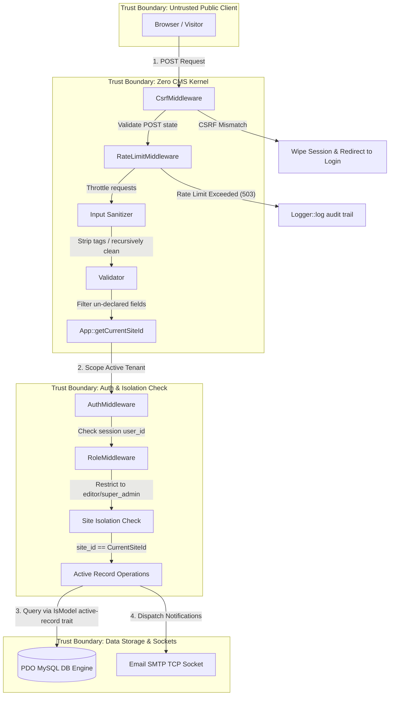

# Zero CMS — Purist Enterprise Architecture & Security Ledger

```text
  ███████╗███████╗██████╗  ██████╗      ██████╗███╗   ███╗███████╗
  ╚══███╔╝██╔════╝██╔══██╗██╔═══██╗    ██╔════╝████╗ ████║██╔════╝
    ███╔╝ █████╗  ██████╔╝██║   ██║    ██║     ██╔████╔██║███████╗
   ███╔╝  ██╔══╝  ██╔══██╗██║   ██║    ██║     ██║╚██╔╝██║╚════██║
  ███████╗███████╗██║  ██║╚██████╔╝    ╚██████╗██║ ╚═╝ ██║███████║
  ╚══════╝╚══════╝╚═╝  ╚═╝ ╚═════╝      ╚═════╝╚═╝     ╚═╝╚══════╝
  "Zero Dependencies. Zero Bloat. Absolute Structural Integrity."
```

## Introduction & Purist Manifesto

**Zero CMS** is a zero-dependency, ultra-high-performance, multi-tenant content management system and transactional e-commerce platform. In an era dominated by bloated, nested package-manager architectures and vulnerable dependency spiders, Zero CMS takes a radical return to fundamental software engineering principles:

* **0% External Dependencies:** No Composer, no NodeJS, no npm, no Tailwind, no third-party framework wrappers. Everything runs on bare-metal native PHP and raw SQL.
* **Instantaneous execution (Sub-1ms):** Bypasses all middleware boot latency and array-scanning dispatchers.
* **Hardened Security Boundaries:** Engineered to resist AI-automated vulnerability scans via zero-dependency CSRF, input recursive sanitization, honed honeypots, rate limiters, and strict multi-tenant Active-Record scoping.

---

## 1. System Bootstrapping & Cascading MVC Architecture

Zero CMS routes and resolves multi-tenant contexts in a single, highly optimized workflow:

```text
[HTTP Web Request]
       │
       ▼
[index.php (Front Controller Gateway)]
       │
       ▼
[App::bootstrap() - UNION ALL Context Extraction]
       │
       ├──► Query DB (UNION ALL): Site Configuration + Authenticated User
       ▼
[Router::handle() - Route Pattern Matcher]
       │
       ├──► Is module enabled for active Site?
       │     ├── YES: Load module controllers & Views
       │     └── NO : Skip route mapping (Return 404)
       ▼
[View Cascading Resolver]
       ├──► Check `/src/Views/themes/{activeSiteTheme}/{template}.php`
       └──► Fallback to `/src/Views/themes/default/{template}.php` (Cascading inheritance)
```

### Single-Query UNION ALL Bootstrapping
On bootstrap, Zero CMS resolves the active tenant Site details (via `HTTP_HOST`) and the logged-in User profile (via session `user_id`) in a **single-query database roundtrip** using a consolidated `UNION ALL` query, avoiding redundant TCP connection overhead:

```sql
SELECT
    'site' AS record_type, id, name, domain, theme, enabled_modules,
    NULL AS email, NULL AS password_hash, NULL AS role, NULL AS site_id, NULL AS preferences,
    created_at, updated_at
FROM sites WHERE domain = ?
UNION ALL
SELECT
    'user' AS record_type, id, username AS name, NULL AS domain, NULL AS theme, NULL AS enabled_modules,
    email, password_hash, role, site_id, preferences,
    created_at, updated_at
FROM users WHERE id = ?
```

---

## 2. Platform Modules

Zero CMS is divided into fully decoupled, modular plug-ins:

1. **Pages & Dynamic Layout Block Builder:**
   Pages are stored in the database as serialized JSON arrays of content blocks (e.g. Accordions, Galleries, Testimonials, Sub-Pages). Adding an block admin view automatically registers editing schemas generically in the back-office, while custom blocks render on the frontend cascadingly.
2. **Luxe E-Commerce Store:**
   Manages product catalogs, parent categories, and SKU matrices. Checkout operations utilize **ACID row-level database locks (`FOR UPDATE`)** to prevent inventory double-selling under high concurrency.
3. **Form Builder & archival Submissions:**
   Enables designers to construct customized forms inside the page builder dynamically. Submissions are validated through `Validator` and archived securely as dynamic JSON structures, preserving exact submission history even if the source page or form is later deleted.
4. **Blog & relational Comments with SMTP Emailer:**
   Classic publishing module supporting secure comments with dynamic moderation lists. Selected administrative users receive instant comment notifications dispatched directly on raw TCP mail sockets (removing standard email dependency wrappers).
5. Community Forum:**
   Features localized discussion boards, threads, and infinite recursive replies mapping via self-referencing `parent_id` foreign keys.
6. **Platform Security Hardening & AI Auditing:**
   Integrates globally enforced Content Security Policy (CSP), defensive HTTP shielding, secure forced password updates, security audit logging, and automated telemetry threat-modeling with Google's generative AI.

---

## 3. Directory Layout Map

```text
/data/misc/zero/
├── GEMINI.md                    # System guidelines, coding standards, and developer rules
├── index.php                     # Central Front-Controller Gateway
├── etc/                          # Secure configuration and setup files (Deny from all)
│   └── install.php               # Secure database schema builder & admin creator (CLI-only)
├── assets/                       # Publicly accessible static assets
│   ├── css/                      # Modular style files (admin.css, shop.css, forum.css)
│   │   └── admin/                # Decoupled admin views CSS imports (block-builder, components)
│   └── svgs/                     # Vector icons
├── seeders/                      # Database seeders
│   ├── seeder.php                # Master seeder executor
│   └── data/                     # Multitenant JSON records (documentation, shop, kitchensink)
├── src/                          # OOP core framework engine
│   ├── Core/                     # Kernel, Bootstrapping, App, Env, Validator
│   ├── Database/                 # Connection, Migrations, DB, Migration
│   ├── Http/                     # HTTP infrastructure, Router, Middleware, Controllers
│   ├── Interfaces/               # Strict OOP contracts
│   ├── Models/                   # Core active-record entities (Media, Page, Site, User)
│   └── Modules/                  # Decoupled extensible modules
│       ├── Admin/                # Unified Back-Office dashboard controller & views
│       ├── Blog/                 # Classic publishing and Commenting Module
│       ├── FormBuilder/          # Dynamic forms creation and submission logs module
│       ├── Forum/                # Community Forum (boards, threads, nested posts)
│       ├── Security/             # Platform security hardening & AI threat auditing module
│       └── Shop/                 # Luxe E-Commerce transactional checkout storefront
└── tests/                        # Zero-dependency Automated Testing Suite
```

---

## 4. System Security & Threat Model

The security boundaries of Zero CMS are rigorously isolated. Below is the **Threat Model & trust Boundaries Diagram** representing request validation, isolation checks, and security remediations:

### 1. Threat Model & Trust Boundaries Diagram



### 2. STRIDE Threat Model & Source Code Remediation Matrix

Zero CMS is engineered under a strict, zero-trust security blueprint. Below is the formal **STRIDE** security threat analysis mapped directly to the actual mitigation systems implemented in the codebase:

| Threat Category | Specific System Risk | Direct Source Code Mitigation & Remediation |
| :--- | :--- | :--- |
| **S**poofing | **CSRF & Session Hijacking:** Attackers executing forged cross-site POST/PUT/DELETE requests or hijacking admin authentication maps. | * Cryptographic CSRF token generation and validation verified natively via `Zero\Support\Security::csrfToken()` and `Zero\Support\Security::csrfVerify()` (inside `src/Support/Security.php`).<br>* Globally enforced on all state-changing requests by `Zero\Http\Middleware\CsrfMiddleware` (inside `src/Http/Middleware/CsrfMiddleware.php`).<br>* Existing sessions and cached tokens are cleanly wiped on GET error fallbacks inside `LoginController::handle()` (inside `src/Modules/Admin/Controllers/LoginController.php`) to prevent cross-site leaks. |
| **T**ampering | **SQL Injection (SQLi), Cross-Site Scripting (XSS), & Parameter Tampering:** Injecting malformed query variables, persistent script blocks, or un-declared posted form fields. | * **SQLi Prevention:** Raw prepared statement parameter bindings enforced globally via the central database transceiver `Zero\Database\DB::query()` (inside `src/Database/DB.php`), guaranteeing 100% prepared statement execution.<br>* **XSS Mitigation:** Public payloads cleaned recursively on boot via `Zero\Support\Security::sanitizeInput()` and advanced interactive block text rendering validated by the raw HTML sanitizer `Zero\Support\Security::sanitizeHtml()` (inside `src/Support/Security.php`), stripping malformed characters, dangerous script tags, and `javascript:` / `data:` protocols.<br>* **Parameter Tampering Prevention:** Form and model data verified against declarative schemas compiled by the core `Zero\Core\Validator` engine (inside `src/Core/Validator.php`), which strictly filters out non-declared fields using `$validator->getValidatedData()` before database writes. |
| **R**epudiation | **Audit Trail Failures:** Privileged administrators or rogue users executing state-changing operations (e.g. deleting pages, modifying variant stock) without persistent, un-mutilated audit logs. | * Dynamic, non-repudiable audit logging handled globally by `Zero\Support\Logger::log()` (inside `src/Support/Logger.php`), which records the triggering user's UUID, the specific action category, the targeted table, the target record ID, and serializes metadata (including the caller's IP address) as structured JSON directly into the persistent `audit_logs` database table. |
| **I**nformation Disclosure | **Multi-Tenant Data Leaks:** Rogue site tenants or external crawlers attempting to query, modify, or leak sensitive records (categories, pages, media, orders) belonging to other brands. | * Zero-trust multi-tenant isolation enforced natively by the ActiveRecord trait `Zero\Models\Traits\IsModel` (inside `src/Models/Traits/IsModel.php`).<br>* All read, save, and soft-delete statements (specifically `IsModel::all()` and `IsModel::save()`) automatically append active tenant scoping filters (`site_id = ?` based on `App::getCurrentSiteId()`), completely blocking cross-tenant boundaries on the database level. |
| **D**enial of Service | **Botnet Portal Flooding & Login Brute-Forcing:** Automated scripts flooding contact gateways with spam, brute-forcing back-office logins, or exhausting DB connections. | * **Spam Mitigation:** Forms utilize zero-friction hidden input fields named `website_url` styled with invisible classes (e.g. `.website-field-wrapper` inside `assets/css/blocks/form_builder.css`). Automated spambots are completely fooled into populating this decoy field. If populated, `FormApiController` (inside `src/Modules/FormBuilder/Controllers/FormApiController.php`) and `CommentsController` (inside `src/Modules/Blog/Controllers/Api/CommentsController.php`) silently drop the submission without DB writes.<br>* **Brute-Force Throttling:** Strict rate-limiting enforced globally via `Zero\Http\Middleware\RateLimitMiddleware` (inside `src/Http/Middleware/RateLimitMiddleware.php`) using custom sliding-window limits. Failed logins are further throttled using exact 1-second system `sleep(1)` delays inside `LoginController` (inside `src/Modules/Admin/Controllers/LoginController.php`) and `ForgotController` (inside `src/Modules/Admin/Controllers/ForgotController.php`) to completely eliminate timing analysis leakage vectors. |
| **E**levation of Privilege | **Administrative Role Bypass:** Normal editors or guest visitor sessions attempting to execute restricted administrative commands or modify other user profiles. | * Absolute boundary protection enforced via a dynamic declarative role verification pipeline (`App::applyRoleMiddleware('super_admin')` / `App::applyAuthMiddleware()`), evaluated natively inside individual back-office controllers (such as `AdminApiController.php` inside `src/Modules/Admin/Controllers/Api/AdminApiController.php`) to block non-super_admin sessions before data execution. |

---

## 5. Automated Testing & Continuous Integration

Zero CMS maintains absolute stability and multi-tenant isolation via a **Zero-Dependency Automated Testing Suite** nested inside `/tests/`:

* **psr-4 Autoloading:** `tests/bootstrap.php` boots CLI-safe environments and loads namespaces dynamically.
* **Subprocess Isolation:** `tests/run.php` scans for suites matching `*Test.php` and executes each sequentially inside an **isolated PHP subprocess** (`exec("php {testFile}")`), preventing static variables, mock session variables, and transactional database connections from bleeding between tests.

### Execution
Run the automated unit testing suite inside the container before staging or deploying code:
```bash
docker exec -w /data/misc/zero php83 php tests/run.php
```
