# 🗺️ Zero CMS Guide Site Sitemap (Technical Developer Docs)

This document contains a comprehensive, multi-layered sitemap representation of the **Zero CMS Technical Developer Docs** guide site (seeded natively via `src/Modules/DemoGenerator/Seeders/documentation.php` and hosted on the `d6laptop.zero.guide` tenant domain). 

It models the precise page structures, parent-child relationships, sub-page branches, and navigation visibility gates.

---

## 📊 Interactive Mermaid Sitemap Diagram

The flowchart below visualizes the site's information architecture. Top-level primary navigation items are highlighted in blue, the Home/Root page in deep green, general information sub-pages in grey, specialized developer How-To guide sheets in gold, modular subsystem specs in purple, and deep-dive technical tutorials in rose.

```mermaid
graph TD
    %% Node Definitions & Hierarchy
    home["🏠 Developer Docs Central<br/><i>(Slug: '')</i>"]
    
    %% Top Level Nav
    contact["✉️ Technical Contact & Feedback Form<br/><i>(Slug: 'contact')</i>"]
    blog["✍️ Blog Index<br/><i>(Slug: 'blog')</i>"]
    docs["📚 Developer Documentation Index<br/><i>(Slug: 'docs')</i>"]
    
    home --> contact
    home --> blog
    home --> docs
    
    %% Documentation Sub-pages
    benchmarks["⚡ Performance & Load Benchmarks<br/><i>(Slug: 'docs/benchmarks')</i>"]
    intro["🚀 Introduction to Zero CMS<br/><i>(Slug: 'docs/intro')</i>"]
    framework["⚖️ Zero vs. The Giants Framework Comparison<br/><i>(Slug: 'docs/framework-comparison')</i>"]
    limitations["⚠️ Limitations of Zero CMS<br/><i>(Slug: 'docs/limitations')</i>"]
    getting_started["⚙️ Installation & Environment Setup<br/><i>(Slug: 'docs/getting-started')</i>"]
    core_components["🧩 Core Components & Helpers<br/><i>(Slug: 'docs/core-components')</i>"]
    bootstrap["🔄 Single-Query Bootstrap Handshake<br/><i>(Slug: 'docs/bootstrap')</i>"]
    
    docs --> benchmarks
    docs --> intro
    docs --> framework
    docs --> limitations
    docs --> getting_started
    docs --> core_components
    docs --> bootstrap
    
    %% How-To Guides Hub -- three category sub-hubs, each with its own sub_pages listing
    how_tos["🔧 How-To Guides Index<br/><i>(Slug: 'docs/how-tos')</i>"]
    docs --> how_tos
    
    core_concepts_hub["🧠 Core Concepts<br/><i>(Slug: 'docs/how-tos/core-concepts')</i>"]
    extending_hub["🧩 Extending the Platform<br/><i>(Slug: 'docs/how-tos/extending')</i>"]
    operations_hub["🚀 Operations & Deployment<br/><i>(Slug: 'docs/how-tos/operations')</i>"]
    
    how_tos --> core_concepts_hub
    how_tos --> extending_hub
    how_tos --> operations_hub
    
    %% Core Concepts: how the framework itself works
    models["📦 Database Models & Active Record Traits<br/><i>(Slug: 'docs/how-tos/core-concepts/models')</i>"]
    views["🎨 How to Create Views & Fallbacks<br/><i>(Slug: 'docs/how-tos/core-concepts/views')</i>"]
    seeder["🌱 How to Create a Custom Seeder<br/><i>(Slug: 'docs/how-tos/core-concepts/seeder')</i>"]
    middleware["🛡️ How to Create Middleware Filters<br/><i>(Slug: 'docs/how-tos/core-concepts/middleware')</i>"]
    controllers["🎮 How to Create Controllers<br/><i>(Slug: 'docs/how-tos/core-concepts/controllers')</i>"]
    uuidv7["🔑 Understanding Time-Ordered UUIDv7 Keys<br/><i>(Slug: 'docs/how-tos/core-concepts/uuidv7')</i>"]
    emailer["📧 SMTP TCP Socket Emailing<br/><i>(Slug: 'docs/how-tos/core-concepts/emailer')</i>"]
    multitenancy["🔒 Multi-Tenant Data Isolation<br/><i>(Slug: 'docs/how-tos/core-concepts/multitenancy')</i>"]
    security_hard["🛡️ Core Security Hardening & Anti-XSS<br/><i>(Slug: 'docs/how-tos/core-concepts/security')</i>"]
    migrations_page["🧬 Writing Database Migrations<br/><i>(Slug: 'docs/how-tos/core-concepts/migrations')</i>"]
    
    core_concepts_hub --> models
    core_concepts_hub --> views
    core_concepts_hub --> seeder
    core_concepts_hub --> middleware
    core_concepts_hub --> controllers
    core_concepts_hub --> uuidv7
    core_concepts_hub --> emailer
    core_concepts_hub --> multitenancy
    core_concepts_hub --> security_hard
    core_concepts_hub --> migrations_page
    
    %% Extending the Platform: building on top of the framework
    module_settings_page["🎛️ Per-Module Site Settings<br/><i>(Slug: 'docs/how-tos/extending/module-settings')</i>"]
    form_fields_page["🧾 The FormField Component System<br/><i>(Slug: 'docs/how-tos/extending/form-fields')</i>"]
    custom_views["🖼️ Custom Column listView Rendering<br/><i>(Slug: 'docs/how-tos/extending/custom-views')</i>"]
    custom_blocks["🧱 Creating Page Builder Blocks<br/><i>(Slug: 'docs/how-tos/extending/custom-blocks')</i>"]
    list_actions["🔘 Registering Custom Admin List Actions<br/><i>(Slug: 'docs/how-tos/extending/list-actions')</i>"]
    oauth_page["🔑 Google OAuth 2.0 Single Sign-On<br/><i>(Slug: 'docs/how-tos/extending/oauth')</i>"]
    search_arch["🔍 Search Index & Driver Architecture<br/><i>(Slug: 'docs/how-tos/extending/search-architecture')</i>"]
    
    extending_hub --> module_settings_page
    extending_hub --> form_fields_page
    extending_hub --> custom_views
    extending_hub --> custom_blocks
    extending_hub --> list_actions
    extending_hub --> oauth_page
    extending_hub --> search_arch
    
    %% Operations & Deployment: running and shipping the platform
    testing_page["🧪 Automated Test Suite Conventions<br/><i>(Slug: 'docs/how-tos/operations/testing')</i>"]
    ci_cd_page["🚦 Continuous Integration & Automated Releases<br/><i>(Slug: 'docs/how-tos/operations/ci-cd')</i>"]
    supervisor["🔄 Supervisor Queue Daemon Setup<br/><i>(Slug: 'docs/how-tos/operations/supervisor-setup')</i>"]
    gcs["☁️ Configuring Google Cloud Storage<br/><i>(Slug: 'docs/how-tos/operations/gcs-setup')</i>"]
    secure_uploads["🔏 Secure Uploads & Private Storage<br/><i>(Slug: 'docs/how-tos/operations/secure-uploads')</i>"]
    s3["🗄️ Configuring AWS S3 Storage<br/><i>(Slug: 'docs/how-tos/operations/aws-s3-setup')</i>"]
    deploy["☁️ Serverless Deployments & low-cost Cloud Run<br/><i>(Slug: 'docs/how-tos/operations/deploy-cloud-run')</i>"]
    standalone_projects["📦 Standalone Project Creation & Core Syncing<br/><i>(Slug: 'docs/how-tos/operations/standalone-projects')</i>"]
    
    operations_hub --> testing_page
    operations_hub --> ci_cd_page
    operations_hub --> supervisor
    operations_hub --> gcs
    operations_hub --> secure_uploads
    operations_hub --> s3
    operations_hub --> deploy
    operations_hub --> standalone_projects
    
    %% Platform Modules Hub
    modules["📦 Platform Modules Directory<br/><i>(Slug: 'docs/modules')</i>"]
    docs --> modules
    
    mod_create["🧱 How to Create Modules<br/><i>(Slug: 'docs/modules/how-to-create')</i>"]
    mod_blog["📝 Blog & Commenting Module<br/><i>(Slug: 'docs/modules/blog')</i>"]
    mod_shop["🛒 Shop & E-Commerce Module<br/><i>(Slug: 'docs/modules/shop')</i>"]
    mod_form["📋 FormBuilder & Submissions Module<br/><i>(Slug: 'docs/modules/formbuilder')</i>"]
    mod_forum["💬 Community Forum Module Guide<br/><i>(Slug: 'docs/modules/forum')</i>"]
    mod_jobs["⏳ Background Jobs & Task Scheduler<br/><i>(Slug: 'docs/modules/jobs')</i>"]
    mod_security["🛡️ Security & Threat Auditing Module<br/><i>(Slug: 'docs/modules/security')</i>"]
    
    modules --> mod_create
    modules --> mod_blog
    modules --> mod_shop
    modules --> mod_form
    modules --> mod_forum
    modules --> mod_jobs
    modules --> mod_security
    
    %% Deep-Dive Advanced Tutorials
    blog_triggers["🔴 Tutorial: Comment Trigger Notifications<br/><i>(Slug: 'docs/modules/blog/comment-triggers')</i>"]
    jobs_tutorials["🔴 Tutorial: Creating & Dispatching Queue Jobs<br/><i>(Slug: 'docs/modules/jobs/tutorials')</i>"]
    
    mod_blog --> blog_triggers
    mod_jobs --> jobs_tutorials
    
    form_advanced["⚙️ FormBuilder Advanced Index<br/><i>(Slug: 'docs/modules/formbuilder/advanced')</i>"]
    form_custom_fields["🔴 Tutorial: Extending Validator Rules<br/><i>(Slug: 'docs/modules/formbuilder/custom-fields')</i>"]
    form_save_submissions["🔴 Tutorial: Capturing Form Submissions<br/><i>(Slug: 'docs/modules/formbuilder/save-submissions')</i>"]
    
    mod_form --> form_advanced
    form_advanced --> form_custom_fields
    form_advanced --> form_save_submissions

    %% Style Classes Mapping
    classDef home fill:#022c22,stroke:#10b981,stroke-width:2px,color:#fff;
    classDef nav fill:#1e3a8a,stroke:#3b82f6,stroke-width:2px,color:#fff;
    classDef page fill:#1f2937,stroke:#4b5563,stroke-width:1px,color:#fff;
    classDef howto fill:#3f2c00,stroke:#f59e0b,stroke-width:1.5px,color:#fff;
    classDef module fill:#3c0764,stroke:#8b5cf6,stroke-width:1.5px,color:#fff;
    classDef tutorial fill:#4c0519,stroke:#f43f5e,stroke-width:1.5px,color:#fff;

    class home home;
    class contact,blog,docs nav;
    class benchmarks,intro,framework,limitations,getting_started,core_components,bootstrap page;
    class how_tos,core_concepts_hub,extending_hub,operations_hub,models,views,seeder,middleware,controllers,uuidv7,emailer,multitenancy,security_hard,custom_views,custom_blocks,supervisor,gcs,secure_uploads,s3,search_arch,standalone_projects,list_actions,migrations_page,testing_page,oauth_page,module_settings_page,form_fields_page,ci_cd_page howto;
    class modules,mod_create,mod_blog,mod_shop,mod_form,mod_forum,mod_jobs,mod_security,form_advanced module;
    class blog_triggers,jobs_tutorials,form_custom_fields,form_save_submissions tutorial;
```

---

## 📂 Detailed Page Architecture & Configurations Directory

The table below catalogs every page record compiled on seed bootstrap, capturing their navigation visibility mapping (`show_in_nav`) and respective path routing rules.

| Page Title | Route Slug | Parent/Branch | Navigation Visible (`show_in_nav`) | Primary Block Element Types |
| :--- | :--- | :--- | :---: | :--- |
| **Developer Documentation Central** | `""` (Root) | Root / Gateway | **Yes (`1`)** | `baseline` (Video), `grid` (Platform Capabilities), `text`, `text_image` |
| **Technical Contact & Feedback Form** | `contact` | Root / Sidebar | **Yes (`1`)** | `form_builder` (Dynamic Contact Form Block) |
| **Blog** | `blog` | Root / Sidebar | **Yes (`1`)** | `latest_articles` (Grid block-renderer) |
| **Developer Documentation** | `docs` | Root / Sidebar | **Yes (`1`)** | `baseline`, `sub_pages` (Dynamic sub-page cards hub) |
| **Zero CMS On-Demand Sandbox Demo Generator** | `docs/demo` | Docs | No (`0`) | `demo_creator` (Interactive form to spin up demo multi-tenant sandboxes) |
| **Performance & Load Benchmarks** | `docs/benchmarks` | Docs | No (`0`) | `baseline`, `text`, `chart` (Throughput/Response), `grid`, `code` (ab log) |
| **Introduction to Zero CMS** | `docs/intro` | Docs | No (`0`) | `text` (Core Philosophy & Abstract Boundaries) |
| **Framework Comparison: Zero vs. The Giants** | `docs/framework-comparison` | Docs | No (`0`) | `text` (Comprehensive architectural metrics grid) |
| **Limitations of Zero CMS** | `docs/limitations` | Docs | No (`0`) | `text` (Dependency trade-offs & AI Paradox explanation) |
| **Installation and Environment Setup** | `docs/getting-started` | Docs | No (`0`) | `text`, `code` (local server & seed commands) |
| **Core Components and Core Helpers** | `docs/core-components` | Docs | No (`0`) | `text` (App Bootstrapper, DB PDO Prepared Wrapper) |
| **Single-Query Bootstrap and Performance** | `docs/bootstrap` | Docs | No (`0`) | `text`, `code` (Consolidated SQL UNION query, static singleton latch) |
| **How To's** | `docs/how-tos` | Docs / Sub-Hub | No (`0`) | `sub_pages` (3 category cards: Core Concepts, Extending, Operations) |
| **Core Concepts** | `docs/how-tos/core-concepts` | How-Tos / Sub-Hub | No (`0`) | `sub_pages` (Framework internals topic list) |
| **Extending the Platform** | `docs/how-tos/extending` | How-Tos / Sub-Hub | No (`0`) | `sub_pages` (Extensibility topic list) |
| **Operations & Deployment** | `docs/how-tos/operations` | How-Tos / Sub-Hub | No (`0`) | `sub_pages` (Running/shipping topic list) |
| **Database Models and Active Record Traits** | `docs/how-tos/core-concepts/models` | How-Tos / Core Concepts | No (`0`) | `text`, `code` (creating models, form configurations, `CascadesDeletes` + SQL identifier validation) |
| **How to Create Views** | `docs/how-tos/core-concepts/views` | How-Tos / Core Concepts | No (`0`) | `text` (Template fallbacks, buffering, layout nesting) |
| **How to Create a Custom Seeder** | `docs/how-tos/core-concepts/seeder` | How-Tos / Core Concepts | No (`0`) | `text` (JSON architecture, running imports) |
| **How to Create Middleware** | `docs/how-tos/core-concepts/middleware` | How-Tos / Core Concepts | No (`0`) | `text`, `code` (Auth onion-pipeline handler) |
| **How to Create Controllers** | `docs/how-tos/core-concepts/controllers` | How-Tos / Core Concepts | No (`0`) | `text` (Interface patterns) |
| **Understanding Time-Ordered UUIDv7 Keys** | `docs/how-tos/core-concepts/uuidv7` | How-Tos / Core Concepts | No (`0`) | `text` (B-Tree pages clustering optimization) |
| **SMTP TCP Socket Emailing** | `docs/how-tos/core-concepts/emailer` | How-Tos / Core Concepts | No (`0`) | `text` (Raw sockets manual dialogue & fsockopen) |
| **Multi-Tenant Data Isolation** | `docs/how-tos/core-concepts/multitenancy` | How-Tos / Core Concepts | No (`0`) | `text` (physical site_id constraints inside IsModel) |
| **Core Security Hardening and Anti-XSS Pipelines** | `docs/how-tos/core-concepts/security` | How-Tos / Core Concepts | No (`0`) | `text`, `code` (CsrfVerify, DOMDocument/DOMXPath scrubber) |
| **Writing Database Migrations** | `docs/how-tos/core-concepts/migrations` | How-Tos / Core Concepts | No (`0`) | `text`, `code` (`Migration` base class, `MigrationManager` discovery/numbering, `bin/migrate`) |
| **Per-Module Site Settings** | `docs/how-tos/extending/module-settings` | How-Tos / Extending | No (`0`) | `text`, `code` (`App::registerModuleSettings()`, `sites.settings` JSON column, min/max clamping, generic `/admin/settings/{moduleId}` page) |
| **The FormField Component System** | `docs/how-tos/extending/form-fields` | How-Tos / Extending | No (`0`) | `text`, `code` (`Zero\Support\Forms`, `FormField` interface, `App::makeFormField()`, `castSubmittedValue()`, custom type registration) |
| **Custom Column Rendering (listView)** | `docs/how-tos/extending/custom-views` | How-Tos / Extending | No (`0`) | `text` (custom badges, site modules list pill views) |
| **Creating Custom Page Builder Blocks** | `docs/how-tos/extending/custom-blocks` | How-Tos / Extending | No (`0`) | `text` (View, Admin Edit fields templates, registration hooks) |
| **Registering Custom Admin List Actions** | `docs/how-tos/extending/list-actions` | How-Tos / Extending | No (`0`) | `text`, `code` (`ManagesModelListActions`, `registerModelListAction()`, worked "Create Demo Site" example) |
| **Google OAuth 2.0 Single Sign-On** | `docs/how-tos/extending/oauth` | How-Tos / Extending | No (`0`) | `text`, `code` (`GoogleAuthController`, anti-CSRF state token, multi-tenant scoping check) |
| **Search Index & Decoupled Driver Architecture** | `docs/how-tos/extending/search-architecture` | How-Tos / Extending | No (`0`) | `text`, `code` (database search driver, block helpers, N+1 preventions) |
| **Automated Test Suite Conventions** | `docs/how-tos/operations/testing` | How-Tos / Operations | No (`0`) | `text`, `code` (per-component `Tests/` layout, `TestRunner` subprocess isolation, `bin/test`) |
| **Continuous Integration & Automated Releases** | `docs/how-tos/operations/ci-cd` | How-Tos / Operations | No (`0`) | `text`, `code` (`run-tests.yml`, Conventional Commits, `bin/release`, `bin/check-commit-messages`, `workflow_run`-gated `release.yml`) |
| **Setting Up Supervisor for the Job Queue** | `docs/how-tos/operations/supervisor-setup` | How-Tos / Operations | No (`0`) | `text` (program configurations, daemon monitoring, log rotate) |
| **Configuring Google Cloud Storage (Zero Dependencies)** | `docs/how-tos/operations/gcs-setup` | How-Tos / Operations | No (`0`) | `text` (Uniform vs ACL buckets, .env setup, Storage API) |
| **Secure Frontend Uploads & Private Storage** | `docs/how-tos/operations/secure-uploads` | How-Tos / Operations | No (`0`) | `text` (binaries obfuscation, secure download route stream) |
| **Configuring AWS S3 Storage (Zero Dependencies)** | `docs/how-tos/operations/aws-s3-setup` | How-Tos / Operations | No (`0`) | `text` (SigV4 cryptographic hmac signature generation) |
| **Serverless Blueprints: Google Cloud Run & Cloud SQL Setup** | `docs/how-tos/operations/deploy-cloud-run` | How-Tos / Operations | No (`0`) | `text`, `code` (Stateless architecture, low-cost db-f1-micro instance/bucket creation, DB_SOCKET connection) |
| **Standalone Project Creation & Core Syncing** | `docs/how-tos/operations/standalone-projects` | How-Tos / Operations | No (`0`) | `text`, `code` (`bin/create-project` Composer bootstrap, `composer update` core syncing, best practices) |
| **Modules** | `docs/modules` | Docs / Sub-Hub | No (`0`) | `sub_pages` (Decoupled system modules list) |
| **How to Create Modules** | `docs/modules/how-to-create` | Modules | No (`0`) | `text` (Hot-swappable toggle structures, widgets) |
| **Blog & Commenting Module** | `docs/modules/blog` | Modules | No (`0`) | `text` (moderation flow), `code` (comment model), `sub_pages` (tutorials) |
| **Shop & E-Commerce Module** | `docs/modules/shop` | Modules | No (`0`) | `text` (capabilities), `code` (product/variant/order models, session-cart checkout -- honestly flags the missing row-lock on stock decrement) |
| **FormBuilder & Submissions Module** | `docs/modules/formbuilder` | Modules | No (`0`) | `text` (JSON archival storage), `code` (schema model), `sub_pages` (tutorials) |
| **Developer How-To** | `docs/modules/formbuilder/advanced` | Modules / FormBuilder | No (`0`) | `sub_pages` (Extensibility tutorials directory) |
| **Tutorial: Programmatically Extending Validator Rules** | `docs/modules/formbuilder/custom-fields` | Modules / FormBuilder | No (`0`) | `code` (Extending custom lambda rules at runtime) |
| **Tutorial: Programmatically Capturing Form Submissions** | `docs/modules/formbuilder/save-submissions` | Modules / FormBuilder | No (`0`) | `code` (Instantiating and persisting Submission model) |
| **Tutorial: Hooking Comments Notification Callback Triggers** | `docs/modules/blog/comment-triggers` | Modules / Blog | No (`0`) | `code` (Hooking comments API and dispatching TCP emails) |
| **Community Forum Module Guide** | `docs/modules/forum` | Modules | No (`0`) | `text` (physical schemas, cascading fallbacks, markdown toolbar) |
| **Background Jobs & Task Scheduler Module** | `docs/modules/jobs` | Modules | No (`0`) | `text` (race prevention double lock, CLI runners vs Async socket) |
| **Creating and Dispatching Queue Jobs** | `docs/modules/jobs/tutorials` | Modules / Jobs | No (`0`) | `text` (dispatching), `code` (SendOrderReceipt stateless class) |
| **Security & Threat Auditing Module** | `docs/modules/security` | Modules | No (`0`) | `text` (compliance, dynamic score calculation), `code` (schema definition) |
